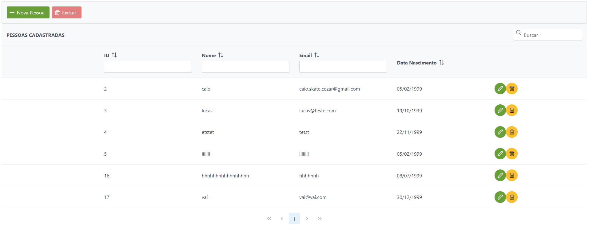
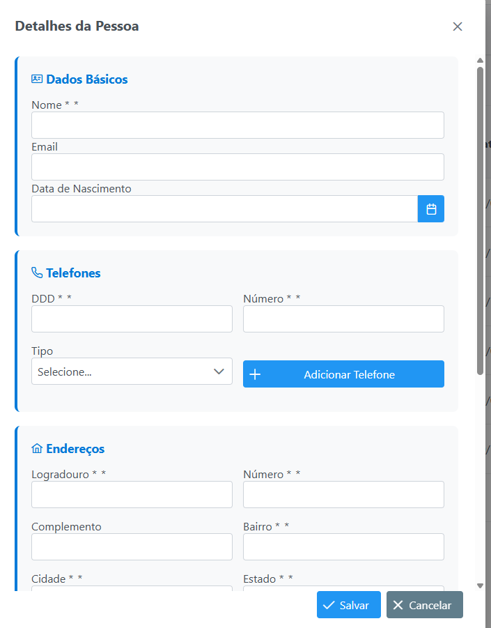

# 🧑‍💼 Sistema CRUD de Pessoas

Sistema completo para gerenciamento de pessoas desenvolvido com **JSF** e **PrimeFaces**.

## 🚀 Tecnologias
- **Java** + **JSF** (Jakarta Faces)
- **PrimeFaces** - Componentes UI
- **JPA/Hibernate** - Persistência
- **MySQL** - Banco de dados
- **Maven** - Gerenciamento de dependências
- **WildFly** - Servidor de aplicação

## 📋 Funcionalidades
- ✅ Cadastro de pessoas
- ✅ Múltiplos telefones
- ✅ Múltiplos endereços  
- ✅ Múltiplos documentos
- ✅ Edição e exclusão
- ✅ Interface responsiva

## 🏃‍♂️ Como executar
1. Clone o repositório
2. Configure o banco MySQL
3. Execute no WildFly
4. Acesse: `http://localhost:8080/pessoa-crud/listagem.xhtml`

## MySql
1. senha do mysql: 
2. Usuario : root
3. Senha: root
## 📸 Screenshots

##

## 👨‍💻 Autor
Caio Cezar Bezerra